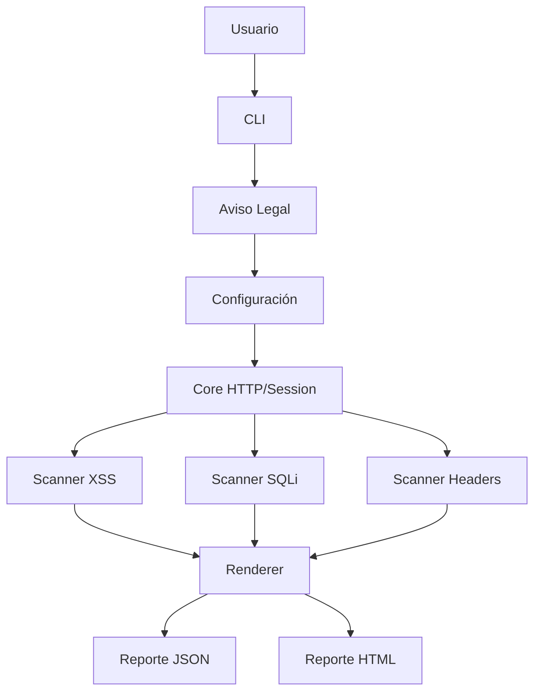

# Arquitectura de VulnLab Scanner

## 1. Visión General
La arquitectura está diseñada bajo el patrón modular, donde cada tipo de vulnerabilidad OWASP es un módulo independiente que hereda de una clase base común. Esto permite fácil mantenimiento y extensibilidad.

## 2. Estructura de Directorios

```
vulnlab-scanner/
├── app/
│   ├── __init__.py
│   ├── main.py                 # Punto de entrada principal
│   ├── cli.py                  # Manejo de argumentos CLI
│   ├── config.py               # Configuración centralizada (.env, defaults)
│   │
│   ├── core/
│   │   ├── __init__.py
│   │   ├── http.py             # Cliente HTTP wrapper (requests)
│   │   └── session.py          # Gestión de sesiones y autenticación
│   │
│   ├── scanner/
│   │   ├── __init__.py
│   │   ├── base.py             # Clase BaseScanner (abstracta)
│   │   ├── xss.py              # Escáner XSS
│   │   ├── sqli.py             # Escáner SQL Injection
│   │   ├── headers.py          # Validador de HTTP Headers
│   │   ├── auth.py             # Escáner de fallos de autenticación (futuro)
│   │   └── access_control.py   # Escáner de control de acceso (futuro)
│   │
│   └── utils/
│       ├── __init__.py
│       ├── logger.py           # Salida coloreada en consola
│       ├── helpers.py          # Funciones auxiliares (validación URL, etc.)
│       ├── renderer.py         # Formateo de resultados en consola
│       ├── reporter.py         # Generación de reportes (JSON/HTML)
│       ├── payloads.py         # Payloads centralizados por vulnerabilidad
│       └── disclaimer.py       # Aviso legal y validación de permisos
│
├── tests/                      # Pruebas unitarias
│   ├── test_xss.py
│   ├── test_sqli.py
│   └── test_headers.py
│
├── reports/                    # Directorio de salida de reportes
├── DOCS/                       # Documentación del proyecto
├── .env                        # Variables de entorno (credenciales)
├── .gitignore
├── requirements.txt
├── README.md
└── DISCLAIMER.md               # Aviso legal completo
```

## 3. Flujo de Datos

```
[Usuario] → [CLI] → [Validación Legal] → [Configuración] → [Core HTTP/Session]
                                                        ↓
[Reporte HTML/JSON] ← [Renderer] ← [Resultados] ← [Scanner XSS/SQLi/Headers]
```

## 4. Componentes Principales

### 4.1 Core (Núcleo)
- **http.py**: Wrapper de `requests` con manejo de timeouts, reintentos y rate limiting
- **session.py**: Gestiona cookies, login automático y mantenimiento de sesión

### 4.2 Scanner (Módulos de Escaneo)
Cada escáner debe heredar de `BaseScanner` e implementar métodos obligatorios.

### 4.3 Utils (Utilidades)
- **payloads.py**: Almacena vectores de ataque para cada vulnerabilidad (no hardcodeados en escáneres)
- **reporter.py**: Genera archivos `.json` y `.html` con resultados
- **disclaimer.py**: Muestra aviso legal y solicita confirmación de permisos

## 5. Dependencias
- **requests**: Cliente HTTP
- **colorama**: Colores en consola
- **python-dotenv**: Carga de variables de entorno
- **jinja2** (opcional): Para plantillas HTML de reportes

## 6. Diagrams (Mermaid)

### Diagrama de Componentes

